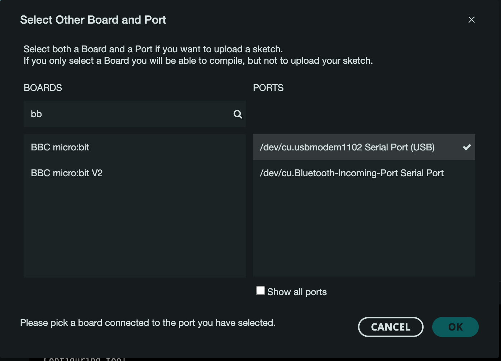

## Microbit Notes

[Arduino IDE setup](https://learn.adafruit.com/use-micro-bit-with-arduino)
(Same as PDF in shared folder)

[Microbit tech specs](https://support.microbit.org/support/solutions/articles/19000119052-details-of-micro-bit-v2)

[Microbit programming guide (Micropython)](https://support.microbit.org/support/solutions/articles/19000119052-details-of-micro-bit-v2)

### Basic getting started

1. As per guide, download the Arduino IDE.  For Windows, this should be the ZIP version that can be run without installation from Downloads folder. Make sure you/ students are aware of this. This should ensure that it will run OK in Windows cluster labs and "roam" with students.
2. Following the Adafruit guide, install the board manager:
In Arduino, go to Preferences and add `https://sandeepmistry.github.io/arduino-nRF5/package_nRF5_boards_index.json`   
into the **Additional Board Manager URL** text box.
3. You shouldn't need to install the Bluetooth SoftModem as we will be connecting via USB.
4. Add the board manager - the instructions are fine but the new IDE looks a bit different. Select the board and the appropriate serial interface:

Mac:

All should now work. Try compiling and uploading the first 'sketch' `01_blink_demo` - it should make the little yellow LED on the back of the board blink on and off.

I've put another couple of examples in our week 6 shared folder, including something that will access the accelerometer.
